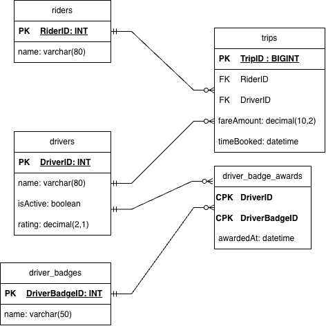

# EX603 Ride-Sharing Database

A relational database modelling a ride-sharing platform: riders book trips with drivers, drivers earn badges, and every trip records the fare paid — supporting operational, financial, and quality-of-service analysis.

**Chosen theme:** Ride Sharing

---

## The Domain

This project models the data layer of a ride-sharing platform such as Uber or Lyft. The platform has two sides: **riders**, who request and pay for trips, and **drivers**, who supply the capacity to fulfil them. Every completed trip is a single event — one row in a high-volume fact table that links one rider to one driver, records when the trip happened, and stores the fare charged. This core booking loop is the busiest part of the system and the source of most of the questions the business needs to answer.

Beyond the booking loop, the platform classifies its supply side. Drivers are awarded **badges** — for example five-star streaks, high completion rates, or EV fleet membership — and those badges are drawn from a shared catalogue rather than stored as free text on each driver. This lets the platform ask consistent, comparable questions about driver quality over time without changing the schema every time a new badge is introduced.

The database is designed to answer questions such as: How much revenue did each driver generate last month? Do badge-holding drivers earn higher average fares? Which drivers are currently active and eligible for dispatch? Are there trips with no rider or no driver attached? How many trips has each rider taken, and what did they spend? These questions drive the schema, the constraints, and the queries built across Units 1–6.

---

## Entity-Relationship Diagram

> *If the image does not render, the file is located at [`schema/erd.png`](schema/erd.png).*

